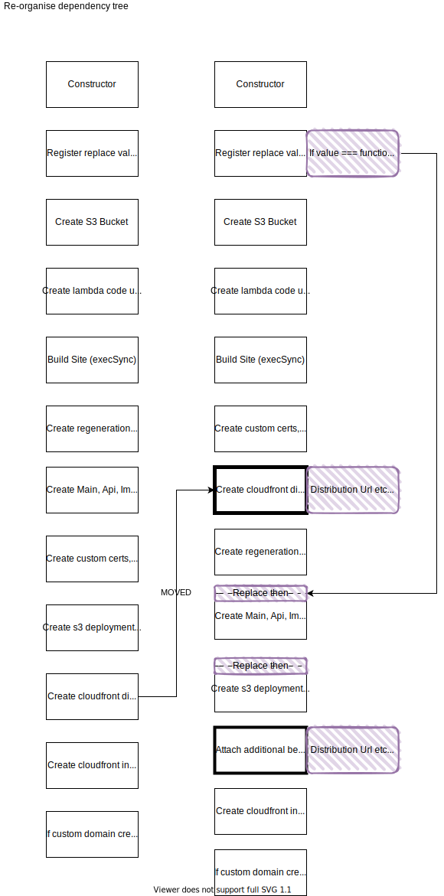

# NextJSSite

## WIP

We need to define all the constructs for all the resources; before
registering the updater code.

So that we can use the values returned by those constructs.

```ts
{
  "MY_SITE_URL": (site: NextjsSite) => site.cfDistribution.domainName
}
```

## Solution

Invert the dependency tree:

1. Deploy the cloudfront distribution earlier.
2. Then create the edge lambdas with the custom resource to replace code.
3. Then attach each lambda as an additional behavior.

### Invert Dependency Tree


